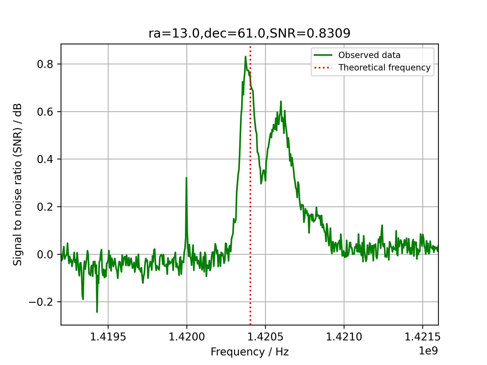
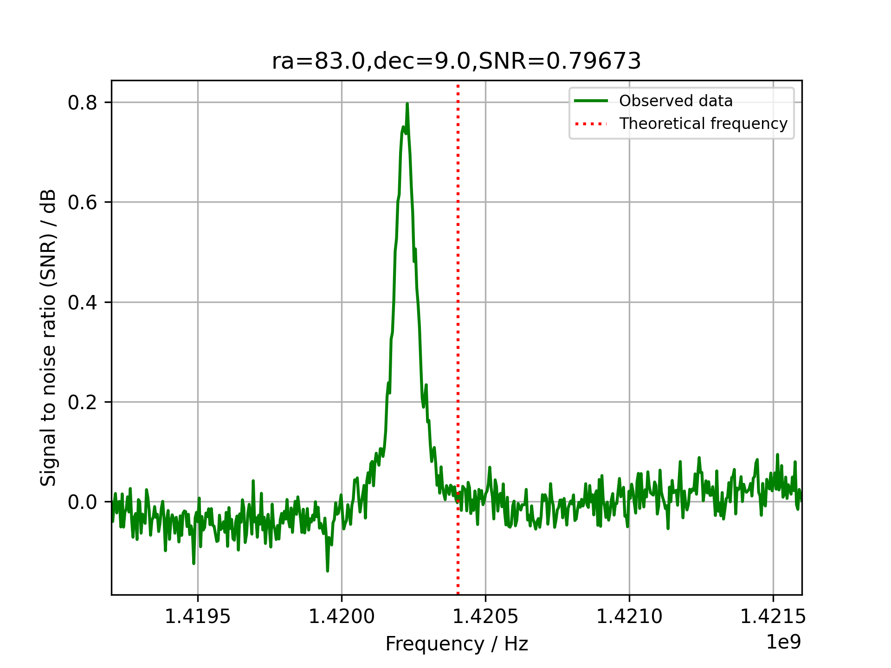

# H-line-software
This software is created with the main purpose of receiving the hydrogen line at a frequency of approximately 1420.4MHz.  
The software uses the [pyrtlsdr library](https://github.com/roger-/pyrtlsdr) to collect samples from the RTL-SDR V3.0 dongle and numpy to perform FFT and signal processing. Finally, the data is shown in a chart from the pyplot library in matplotlib.

## Installing
As usual, the code should be downloaded with git clone.
~~~
git clone https://github.com/byggemandboesen/H-line-software.git
~~~
Some packages are required which can be downloaded with pip (requirements.txt will be added):
~~~
pip install matplotlib
pip install numpy
pip install pyrtlsdr
pip install pyephem
~~~
One should also install [rtl-sdr drivers for windows](https://osmocom.org/attachments/2242/RelWithDebInfo.zip) and add the add the files from the [rtl-sdr drivers](https://ftp.osmocom.org/binaries/windows/rtl-sdr/) into the X64 folder (overwrite the files that already exist). Then the "x64" folder has to be added to PATH under system variables. This will require a shell restart.

## Usage
The software is meant for observing the hydrogen line but it also allows to plot any other frequency inside the RTL-SDR tuner ranger. This means the software has set default preferences for the hydrogen line, but these can be modified according with argparser according to your preferences.  
The following parameters can be modified/added:
~~~
optional arguments:
  -h, --help          show this help message and exit
  -s Sample rate      Tuner sample rate
  -o PPM offset       Set custom tuner offset PPM
  -r Resolution       Amount of samples = 2 raised to the power of the input
  -n Number of FFT's  Number of FFT's to be collected and averaged
  -i Degree interval  Degree interval of each data-collection. Collects data for 24h.
  -l Latitude         The latitude of the antenna's position as a float, north is positive
  -g Longitude        The latitude of the antenna's position as a float, east is positive
  -z Azimuth          The azimuth of the poting direction
  -a Altitude         The elevation of the pointing direction
  -c                  Use lat, lon of QTH and antenna alt/az from config file
~~~
The latitude, longitude, azimuth and altitude can also be modified in the "config.txt" and used by using the console argument "-c". This will then save you some time from writing latitude & longitude.  
If one is located in noisy conditions a resolution at around 8-9 may result in a cleaner spectrum and to increase detail a higher number of FFT's should be taken.

## Examples
The two following spectrums were received with an [RTL-SDR V3.0 dongle](https://www.rtl-sdr.com/buy-rtl-sdr-dvb-t-dongles/), [Nooelec SAWbird+ H1](https://www.nooelec.com/store/sdr/sdr-addons/sawbird/sawbird-h1.html) and a [wifi grid dish](https://www.ebay.de/itm/2-4GHz-WLAN-W-LAN-WiFi-Grid-Richtantenne-Gitter-Antenne-Wetterfest-24dBi/223492035303?ssPageName=STRK%3AMEBIDX%3AIT&_trksid=p2060353.m2749.l2649) with a flipped reflector element for better frequency matching.  
Note the double line in the first image.

Defult settings exept, Resolution = 9, Number of FFT's = 100000  
The following image is a clear representation of doppler shift from the head of Orion around the star Meissa.

Defult settings exept, Resolution = 9, Number of FFT's = 100000  

## TODO
* Direct bias-t interaction
* Calculate relative doppler
* More accurate data collection timing from sample rate
