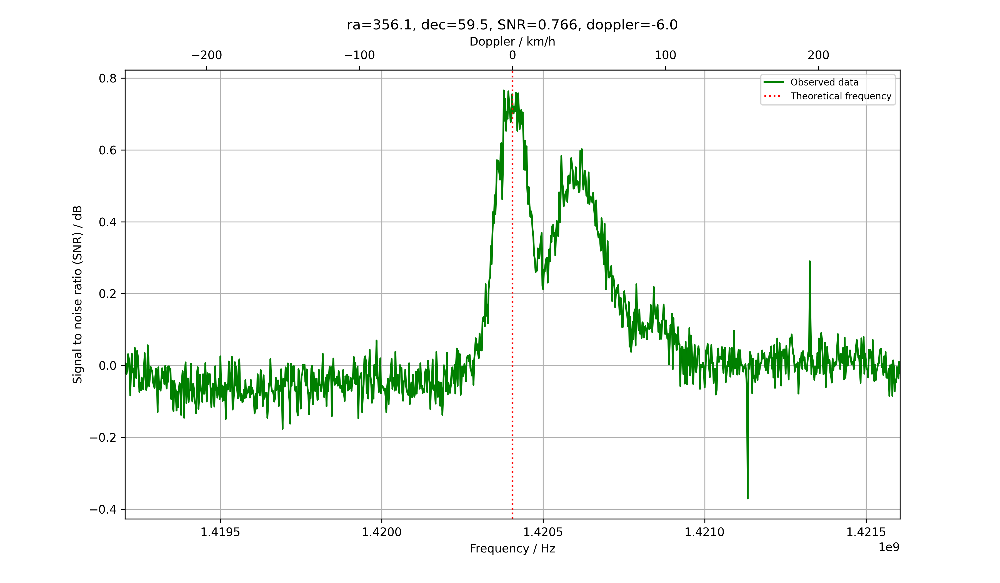

# H-line-software
This software is created with the main purpose of receiving the hydrogen line at a frequency of approximately 1420.4MHz.  
The software uses the [pyrtlsdr library](https://github.com/roger-/pyrtlsdr) to collect samples from the RTL-SDR V3.0 dongle and numpy to perform FFT and signal processing. Finally, the data is shown in a chart from the pyplot library in matplotlib.

## Installing
As usual, the code should be downloaded with git clone.
~~~
git clone https://github.com/byggemandboesen/H-line-software.git
~~~
Some packages are required which can be downloaded with pip:
~~~
pip install matplotlib
pip install numpy
pip install pyrtlsdr
pip install pyephem
~~~
For installing on Linux, make sure to use "pip3 install ...".

### Linux
When installing on Linux, one should install librtlsdr-dev.
~~~
sudo apt install librtlsdr-dev
~~~

### Windows
If you're using windows, you need to manually download the rtl-sdr drivers and add them to system PATH.
Download the [rtl-sdr drivers for windows](https://osmocom.org/attachments/2242/RelWithDebInfo.zip) and add the add the files from the [rtl-sdr drivers](https://ftp.osmocom.org/binaries/windows/rtl-sdr/) into the X64 folder (overwrite the files that already exist). Then the "x64" folder has to be added to PATH under system variables. This will require a shell restart.

## Usage
The software is meant for observing the hydrogen line which means the software has set default receiving parameters, but these can be modified with argparser according to your preferences.  
The following parameters can be modified/added:
~~~
optional arguments:
  -h, --help           show this help message and exit
  -s Sample rate       Tuner sample rate
  -o PPM offset        Set custom tuner offset PPM
  -r Resolution        Amount of samples = 2 raised to the power of the input
  -n Number of FFT's   Number of FFT's to be collected and averaged
  -i Degree interval   Degree interval of each data-collection. Collects data for 24h.
  -m Median smoothing  Number of data-points to compute median from. Smooths data and compresses noise
  -l Latitude          The latitude of the antenna's position as a float, north is positive
  -g Longitude         The latitude of the antenna's position as a float, east is positive
  -z Azimuth           The azimuth of the poting direction
  -a Altitude          The elevation of the pointing direction
  -c                   Use lat, lon of QTH and antenna alt/az from config file
~~~
The latitude, longitude, azimuth and altitude can also be modified in the "config.txt" and used by using the console argument "-c". This will then save you some time from writing latitude & longitude. Keep in mind the azimuth ranges from zero to positive 180 degrees and then goes straight to -180 to 0. This means an azimuth of 270 degrees will be -90 degrees.  
If one is located in noisy conditions a resolution at around 8-9 may result in a cleaner spectrum and to increase detail a higher number of FFT's should be taken. Interference can also be dealt with by smoothing the data with a median filter using "-m X". This will compute the median for each point from X points besides it. An isolated interference spike will therefor be less powerful.
To disable the autoscaling in the plots, you can set your own y-axis interval in the config.txt to for example, low_y = -1 & high_y = 1.

## Examples
The two following spectrums were received with an [RTL-SDR V3.0 dongle](https://www.rtl-sdr.com/buy-rtl-sdr-dvb-t-dongles/), [Nooelec SAWbird+ H1](https://www.nooelec.com/store/sdr/sdr-addons/sawbird/sawbird-h1.html) and a [wifi grid dish](https://www.ebay.de/itm/2-4GHz-WLAN-W-LAN-WiFi-Grid-Richtantenne-Gitter-Antenne-Wetterfest-24dBi/223492035303?ssPageName=STRK%3AMEBIDX%3AIT&_trksid=p2060353.m2749.l2649) with a flipped reflector element for better frequency matching.  
The image is captured pointing at Cassiopeia and it shows three separate peaks with intensity decreasing from left to right.

Default settings used except for number of FFT's, which was 50000. This was captured as a part of a sequence using the "-i" argument and "-c" for using coordinates from the config.txt file.  
The console argument can be seen here:
~~~
py h-line.py -n 50000 -c -i 0.5
~~~
Where 50000 FFT's are used, coordinates from config is used and the interval of data collection is set to 0.5 degrees.

## TODO
* Direct bias-t interaction
* ~~Calculate relative doppler~~
* More accurate data collection timing from sample rate
* Correct doppler from observed galactic coordinates
* ~~RFI removal~~
* Installation on Linux
