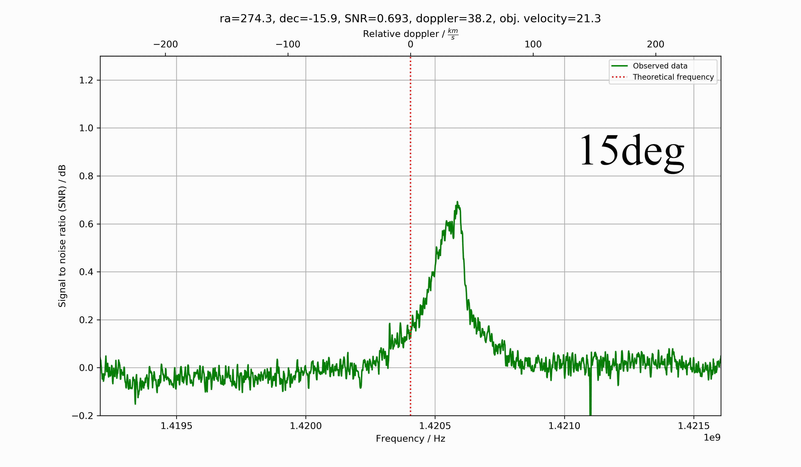

# H-line-software
This software is created with the main purpose of receiving the hydrogen line at a frequency of approximately 1420.4MHz.  
The software uses the [pyrtlsdr library](https://github.com/roger-/pyrtlsdr) to collect samples from the RTL-SDR V3.0 dongle and numpy to perform FFT and signal processing. Finally, the data is shown in a chart from the pyplot library in matplotlib.

## Why choose this software?
This project started as a project of my own to make radio astronomy easy and affordable for everyone. There are great pieces of software out there, [Virgo](https://github.com/0xCoto/Virgo) and [Pictor](https://github.com/0xCoto/PICTOR) are personal favourites and inspirations for my own software.  
Although these require setting up a GNU radio environment, which can sometimes be difficult and too much to ask for it you're a beginner/newcomer to the hobby. It's this exact reason I wanted to create a piece of software that will run on many operating systems and only depend on a couple of python packages.  
TL;DR, you should choose this software if you don't have much experience with the GNU radio environment and software defined radios in generel.

## Installing
As usual, the code should be downloaded with git clone.
~~~
git clone https://github.com/byggemandboesen/H-line-software.git
~~~
Some packages are required which can be downloaded with pip:
~~~
pip install matplotlib
pip install numpy
pip install pyrtlsdr
pip install pyephem
~~~
One can also install the required packages from the "requirements.txt":
~~~
pip install -r requirements.txt
~~~

### Linux
When installing on Linux, one should install librtlsdr-dev, and make sure to use "pip3 install ...".
~~~
sudo apt install librtlsdr-dev
~~~

#### Problems with matplotlib/numpy on Raspberry Pi
If you run into problems with matplotlib and numpy running the software on a Raspberry Pi, more specifically this error - *"Importing the numpy c-extensions failed"*.  
Then run the following command as per [this issue on GitHub](https://github.com/numpy/numpy/issues/15744).
~~~
sudo apt-get install libatlas-base-dev
~~~
However, it is adviced you run the following if other problems occur.:
~~~
sudo apt update
sudo apt upgrade
~~~~

### Windows
If you're using windows, you need to manually download the rtl-sdr drivers and add them to system PATH.
Download the [rtl-sdr drivers for windows](https://osmocom.org/attachments/2242/RelWithDebInfo.zip) and add the add the files from the [rtl-sdr drivers](https://ftp.osmocom.org/binaries/windows/rtl-sdr/) into the X64 folder (overwrite the files that already exist). Then the "x64" folder has to be added to PATH under system variables. This will require a shell restart.

## Usage
The software is meant for observing the hydrogen line which means the software has set default receiving parameters, but these can be modified with argparser according to your preferences.  
The following parameters can be modified/added:
~~~
optional arguments:
  -h, --help            show this help message and exit
  -s Sample rate        Tuner sample rate
  -o PPM offset         Set custom tuner offset PPM
  -r Resolution         Amount of samples = 2 raised to the power of the input
  -n Number of FFT's    Number of FFT's to be collected and averaged
  -i Degree interval    Degree interval of each data-collection. Collects data for 24h.
  -m Median smoothing   Number of data-points to compute median from. Smooths data and compresses noise
  -t                    Run RTL-TCP host for streaming to client
  -e RTL-TCP streaming  Stream from IP of remote server. This command is used for client side.
  -l Latitude           The latitude of the antenna's position as a float, north is positive
  -g Longitude          The longitude of the antenna's position as a float, east is positive
  -z Azimuth            The azimuth of the poting direction
  -a Altitude           The elevation of the pointing direction
  -c                    Use lat, lon of QTH and antenna alt/az from config file
~~~
The latitude, longitude, azimuth and altitude can also be modified in the "config.json" and used by using the console argument "-c". This will then save you some time from writing latitude & longitude. Keep in mind the azimuth ranges from zero to positive 180 degrees and then goes straight to -180 to 0. This means an azimuth of 270 degrees will be -90 degrees.  
If one is located in noisy conditions a resolution at around 9-10 may result in a cleaner spectrum and to increase detail a higher number of FFT's should be taken. Interference can also be dealt with by smoothing the data with a median filter using "-m X". This will compute the median for each point from X points besides it. An isolated interference spike will therefor be less powerful.
To disable the autoscaling in the plots, you can set your own y-axis interval in the config.json to for example, low_y = -1 & high_y = 1. An example of this is shown under examples.

## Examples
the following GIf consists of 19 separate observations from across the galactic plane in 10 degree intervals.  
The observations were done with an [RTL-SDR V3.0 dongle](https://www.rtl-sdr.com/buy-rtl-sdr-dvb-t-dongles/), [Nooelec SAWbird+ H1](https://www.nooelec.com/store/sdr/sdr-addons/sawbird/sawbird-h1.html) and a [wifi grid dish](https://www.ebay.de/itm/2-4GHz-WLAN-W-LAN-WiFi-Grid-Richtantenne-Gitter-Antenne-Wetterfest-24dBi/223492035303?ssPageName=STRK%3AMEBIDX%3AIT&_trksid=p2060353.m2749.l2649) with a flipped reflector element for better frequency matching.  

The observation paramteres used were "-n 50000" for an average of 50k FFT's and "-c" to use information from the config file. In the config file the Y-axis interval for the plot was specified together with the antenna's position on the sky and my observing location in lat/lon coordinates.  
Below is an example of the config file to reproduce these results, although remember the azimuth and altitude coordinates will differ:
~~~
{
    "latitude": xx.xx,
    "longitude": yy.yy,
    "azimuth": -80,
    "altitude": 45,
    "low_y": -0.2,
    "high_y": 1.3
}
~~~
The console argument can be seen here:
~~~
py h-line.py -n 50000 -c
~~~
On Linux the same command would be:
~~~
python3 H-line.py -n 50000 -c
~~~

## Using RTL-TCP
RTL-TCP is supported through the pyrtlsdr package. This allows a device, with an RTL unit connected, to act as a host/server using the following command.  
~~~
py h-line.py -t
~~~
On Linux the same command would be:
~~~
python3 H-line.py -t
~~~
This will create a server open to port 5050 and the device's local ip, for example 192.168.0.29. If you wish to change to local host, you will have to edit the code itself.  
In Rtltcp.py modify the following line in the function "rtltcphost()":  
~~~python
server = RtlSdrTcpServer(hostname = local_ip, port = 5050)
server = RtlSdrTcpServer(hostname = '127.0.0.1', port = 5050)
~~~
Note, using RTL-TCP may be significantly slower than running everything locally depending on wifi/internet speeds.

## Using this with E4000 tuners
Since the intention of this software is to motivate amateurs to give radio astronomy a try the versatility of the software is limited to the packages available. The RTL2832U tuner is well supported by the pyrtlsdr package Although it does lack certain features like offset tuning, which results in degraded performance for E4000 tuner SDR's like the Nooelec Smart XTR for example.  
If the pyrtlsdr package improves/introduces new features that allow for further improvements I will be implementing these in my software ASAP.

## Contributions/credit
I would like to thank [0xCoto](https://github.com/0xCoto) AKA "Apostolos" for letting me use the hydrogen map from the Pictor and Virgo projects.  
I really appreciate his work for the amateur radio astronomy community!

## TODO
* Direct bias-t interaction
* *Stream data to live plot*
* ~~Calculate Earth's velocity towards observed area from galactic/equatorial coordinates~~
* ~~Redesign plot with small Milky way map and observed point~~
* ~~RFI removal~~
* ~~Installation on Linux~~
