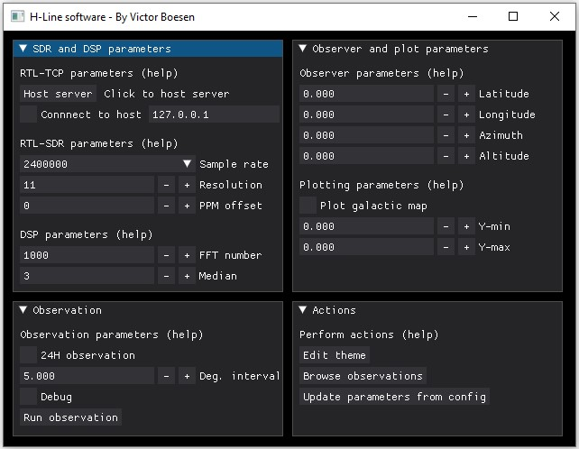
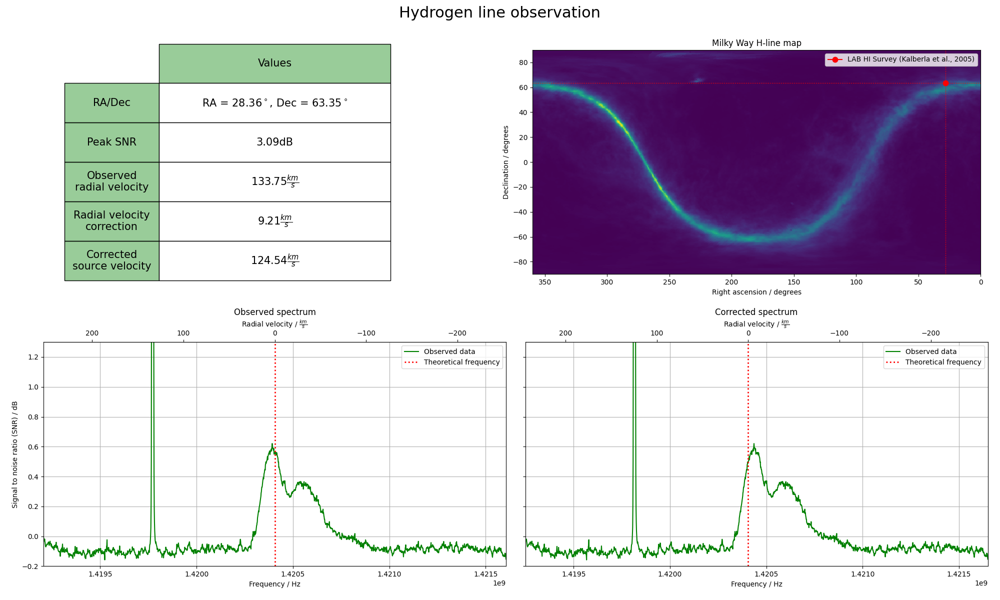

# H-line-software
This software is created with the main purpose of receiving the hydrogen line at a frequency of approximately 1420.4MHz. <br>
The software uses the [pyrtlsdr library](https://github.com/roger-/pyrtlsdr) to collect samples from the RTL-SDR V3.0 dongle and numpy to perform FFT and signal processing. Finally, the data is shown in a chart from the pyplot library in matplotlib.

# Table of contents
- [H-line-software](#h-line-software)
- [Table of contents](#table-of-contents)
  - [Why choose this software?](#why-choose-this-software)
  - [Installing](#installing)
    - [Linux](#linux)
    - [Windows](#windows)
  - [Usage](#usage)
    - [Headless/through terminal](#headlessthrough-terminal)
    - [Optional UI](#optional-ui)
  - [Examples](#examples)
    - [Plot with Milky Way map](#plot-with-milky-way-map)
    - [Using RTL-TCP](#using-rtl-tcp)
    - [Debugging data](#debugging-data)
  - [Errors/FAQ](#errorsfaq)
    - [Problems with matplotlib/numpy on Raspberry Pi](#problems-with-matplotlibnumpy-on-raspberry-pi)
    - [Using this with E4000 tuners](#using-this-with-e4000-tuners)
  - [Contributions/credit](#contributionscredit)
  - [TODO](#todo)

## Why choose this software?
This project started as a project of my own to make radio astronomy easy and affordable for everyone. There are great pieces of software out there, [Virgo](https://github.com/0xCoto/Virgo) and [Pictor](https://github.com/0xCoto/PICTOR) are personal favourites and inspirations for my own software. <br>
However, these require setting up a GNU radio environment, which can sometimes be difficult and too much to ask for it you're a beginner/newcomer to the hobby. It's this exact reason I wanted to create a piece of software that will run on many operating systems and only depend on a couple of python packages. <br>
**TL;DR**, you should choose this software if you don't have much experience with the GNU radio environment and software defined radios in generel.

## Installing
As usual, the code should be downloaded with git clone.
~~~
git clone https://github.com/byggemandboesen/H-line-software.git
~~~
Some packages are required which can be downloaded with pip:
~~~
pip install matplotlib numpy pyephem pyrtlsdr imageio
~~~
One can also install the required packages from the "requirements.txt":
~~~
pip install -r requirements.txt
~~~

### Linux
When installing on Linux, one should install librtlsdr-dev, and make sure to use "pip3 install ...".
~~~
sudo apt install librtlsdr-dev
~~~

### Windows
If you're using windows, you need to manually download the rtl-sdr drivers and add them to system PATH.
Download the [rtl-sdr drivers for windows](https://osmocom.org/attachments/2242/RelWithDebInfo.zip) and add the files from the [rtl-sdr drivers](https://ftp.osmocom.org/binaries/windows/rtl-sdr/) into the X64 folder, overwriting any files that may already exist. The "X64" folder has to be added to PATH under system variables.

## Usage
The software can be run headless on a remote Raspberry pi for example or with the help of the user interface. The following section will describe necessary information about both usage cases.

### Headless/through terminal
Included in the software directory is the `config.json` file which includes all the software parameters.
~~~json
{
    "SDR": {
        "sample_rate": 2400000,
        "PPM_offset": 0,
        "TCP_host": false,
        "connect_to_host": false,
        "host_IP": "127.0.0.1"
    },
    "DSP": {
        "number_of_fft": 1000,
        "resolution": 11,
        "median": 3
    },
    "observer": {
        "latitude": 0.0,
        "longitude": 0.0,
        "azimuth": 0.0,
        "altitude": 0.0
    },
    "plotting": {
        "plot_map": false,
        "y_min": 0.0,
        "y_max": 0.0
    },
    "observation": {
        "24h": false,
        "degree_interval": 5.0,
        "debug": false
    }
}
~~~

* SDR
This section includes parameters such as the SDR sample rate, PPM offset and RTL-TCP parameters. <br>
If you want to host an RTL-TCP server, simply set `TCP_host` to `true`.
If you wish connect to an existing server, set `connect_to_host` to `true` and add the remote `host_IP` of the host.
* DSP
Increasing the `number_of_fft` will average more FFT's and will in many cases improve the shape of the hydrogen line. <br>
Increasing the resolution will receive more samples pr. FFT increasing the general resolution of the FFT. Both of these two parameters will increase sampling/observing time as they are increased but greatly add to the details of the observation. Play around with both! <br>
The `median` parameter determines how many samples should be averaged together in a rolling median filter. This sometimes helps dealing with noise.
* Observer
The geographical position of the observer and the antennas position on the sky. <br>
Lat/lon are east and north positive and range from [-90,90] and [-180,180].<br>
The alt/az are north to east going from [0,360] and [0,90] for altitude.
* Plotting
Allows the user to `plot_map` of the sky observed at the Hydrogen line frequency. <br>
The two last parameters determine the y-axis interval on the spectrum. If left to 0, it auto scales the y-axis.
* Observation
This section allows the user to perform observations with a fixed `degree_interval` for 24 hours. <br>
The last parameter allows the user to write a debug file with the data/parameters from the observation.

To edit any of these parameters, simply edit and save the debug file, and then run the software, `py H-line.py` or `python3 H-line.py`.

### Optional UI
To make it easier to change these parameters one may want to use the optional UI.<br>
This is available by running the `ui.py` file in terminal:
```bash
py ui.py
python3 ui.py
```


If you need help or forget how the parameters work simply hover above the `(help)` text for each section. <br>
The UI is made with the [dearpygui](https://github.com/hoffstadt/DearPyGui) package for python.<br>

## Examples
The following GIF consists of 19 separate observations from across the galactic plane in 10 degree intervals. <br>
The observations were done with an [RTL-SDR V3.0 dongle](https://www.rtl-sdr.com/buy-rtl-sdr-dvb-t-dongles/), [Nooelec SAWbird+ H1](https://www.nooelec.com/store/sdr/sdr-addons/sawbird/sawbird-h1.html) and a [wifi grid dish](https://www.ebay.de/itm/2-4GHz-WLAN-W-LAN-WiFi-Grid-Richtantenne-Gitter-Antenne-Wetterfest-24dBi/223492035303?ssPageName=STRK%3AMEBIDX%3AIT&_trksid=p2060353.m2749.l2649) with a flipped reflector element for better frequency matching. <br>

Besides the default parameters, the following parameters were used for the observations:
```
Numer of FFT = 50000
Median = 0
Y-axis interval = [-0.2,1.3]
```

### Plot with Milky Way map
When setting `show_map: true`, the software plots the observation together with a map of the Milky Way and the observed position.<br>
This also calculates relative velocity and etc. from the direction of the observation and the observed doppler shift.

In this example, the following parameters were used besides the default parameters:
```
Number of FFT = 50000
Median = 10
Y-axis interval = [-0.2,1.3]
```

### Using RTL-TCP
RTL-TCP is supported through the pyrtlsdr package. This allows a device, with an RTL unit connected, to act as a host/server using the `TCP_host` parameter.<br>

This will create a server open to port 5050 and the device's local ip, for example 192.168.0.29. If you wish to change to local host, you will, at the current moment, have to edit the code itself. <br>
In `rtl.py` modify the following line in the function `tcpHost()`: <br>
~~~python
server = RtlSdrTcpServer(hostname = local_ip, port = 5050)
server = RtlSdrTcpServer(hostname = '127.0.0.1', port = 5050)
~~~
Note, using RTL-TCP may be significantly slower than running everything locally depending on wifi/internet speeds.

### Debugging data
Setting the debug parameter to true will write a debug file from the corresponding observation. This includes the observation parameters, and all the received data before and after processing.
~~~json
{
    "SDR Parameters": SDR_PARAM,
    "DSP Parameters": DSP_PARAM,
    "Observation results": {
        "RA": ra,
        "Dec": dec,
        "Radial velocity": radial_velocity,
        "Radial correction": radial_correction,
        "Max SNR": SNR
    },
    "Data": {
        "Blank spectrum": "List with blank spectrum",
        "H-line spectrum": "List with H-line spectrum",
        "SNR Spectrum": "List with the processed data from the two above",
        "Frequency list": "List with frequencies"
    }
}
~~~
## Errors/FAQ
You run into errors when running the software, or have some questions about it. Check the list below to find help. If you didn't find the answer you were looking for, feel free to get in contact with me on [Twitter](https://twitter.com/victor_boesen).

### Problems with matplotlib/numpy on Raspberry Pi
If you run into problems with matplotlib and numpy running the software on a Raspberry Pi, more specifically this error - *"Importing the numpy c-extensions failed"*. <br>
Then run the following command as per [this issue on GitHub](https://github.com/numpy/numpy/issues/15744).
~~~
sudo apt-get install libatlas-base-dev
~~~
However, it is adviced you run the following if other problems occur.:
~~~
sudo apt update
sudo apt upgrade
~~~

### Using this with E4000 tuners
Since the intention of this software is to motivate amateurs to give radio astronomy a try the versatility of the software is limited to the packages available. The RTL2832U tuner is well supported by the pyrtlsdr package Although it does lack certain features like offset tuning, which results in degraded performance for E4000 tuner SDR's like the Nooelec Smart XTR for example. <br>
If the pyrtlsdr package improves/introduces new features that allow for further improvements I will be implementing these in my software ASAP.

## Contributions/credit
I would like to thank [0xCoto](https://github.com/0xCoto) AKA "Apostolos" for letting me use the hydrogen map from the Pictor and Virgo projects. <br>
I really appreciate his work for the amateur radio astronomy community!

## TODO
* Direct bias-t interaction
* Fix inconsistent spectrum size when y-axis autoscales
* Bug-hunting
* Mitigate to astropy
* Allow for DPI scaling of UI

If you reached this far and enjoy my software, it would mean a lot to me, if you showed your support on Ko-fi! If you don't want to tip me, please consider starring the software instead :smiley: <br>
<a href="https://ko-fi.com/victorboesen34500" target="_blank"></a>